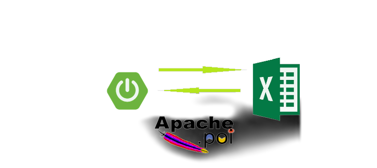
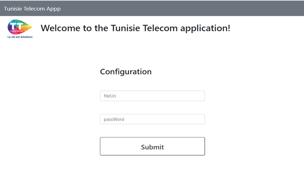
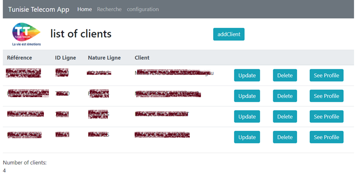
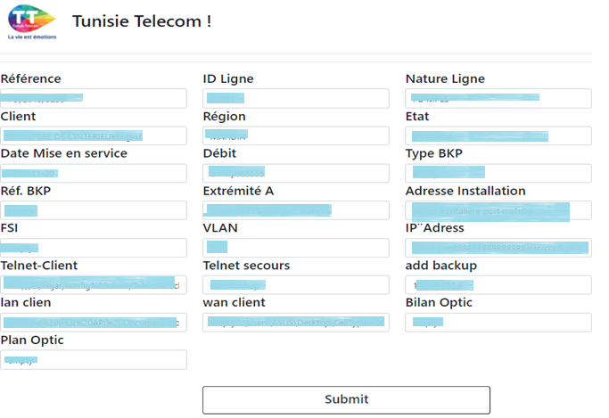
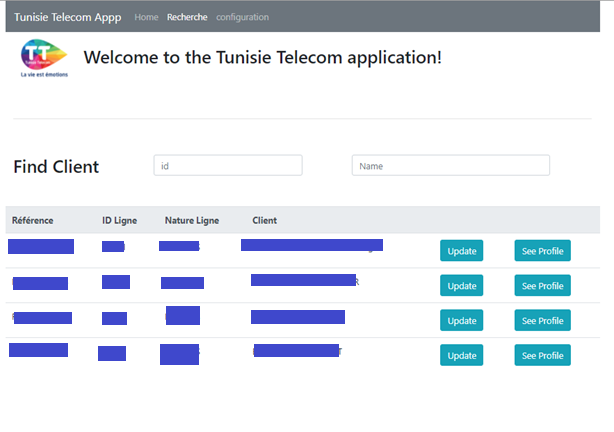

# Web application to manipulate Excel files through a graphical interface.

CRUD operation using Spring Boot with a database in the form of Excel files 




## graphic interfaces realized in this project.


### Login Page


### the first page contains all the rows of the Excel file

### Update a row in the Excel file 



### search in an Excel file



## Requirements

For building and running the application you need:

- [JDK 1.8](http://www.oracle.com/technetwork/java/javase/downloads/jdk8-downloads-2133151.html)
- [Maven 3](https://maven.apache.org)

## Running the application locally

There are several ways to run a Spring Boot application on your local machine. One way is to execute the `main` method in the `de.codecentric.springbootsample.Application` class from your IDE.

Alternatively you can use the [Spring Boot Maven plugin](https://docs.spring.io/spring-boot/docs/current/reference/html/build-tool-plugins-maven-plugin.html) like so:

```shell
mvn spri

